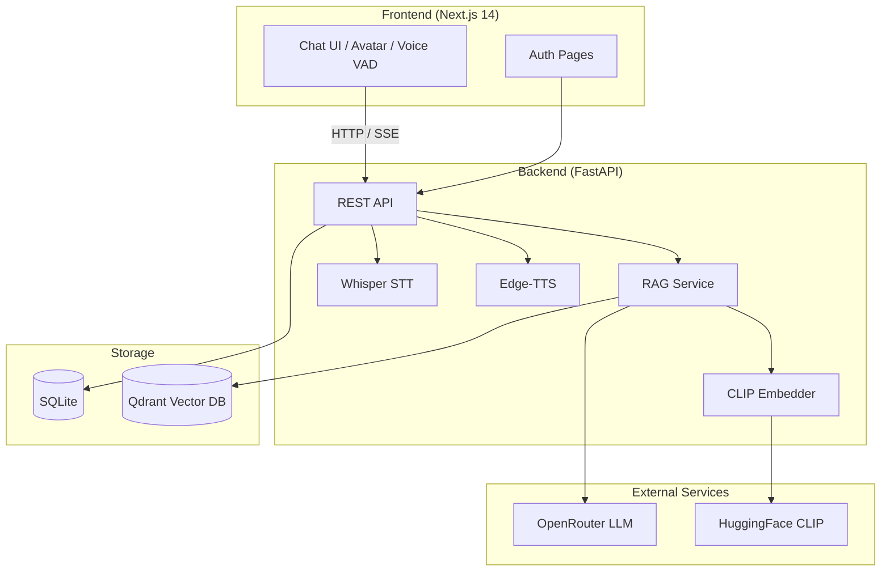

#  PARAK — Intelligent Shopping Assistant

**PARAK** (پَرَک) is a full-stack **Retrieval-Augmented Generation (RAG)** chatbot built for e-commerce. It helps users discover products, search by text or image, ask store & FAQ questions, and interact via voice — all through a modern conversational UI.

---

##  Screenshots

###  Welcome & Quick Actions


###  Product Recommendations & Details


###  Visual / Image Search


###  Store Info & FAQ (Multilingual)


---

##  Highlights

| Feature | Description |
|---------|-------------|
|  **Multimodal RAG** | Text + image search powered by CLIP embeddings in Qdrant |
|  **Smart Intent Routing** | LLM detects whether the user wants products, store info, or FAQ |
|  **Voice Chat** | Browser VAD → Whisper STT → RAG → Edge-TTS with 50+ language voices |
|  **3D AI Avatar** | React Three Fiber avatar with context-aware emotions |
|  **Product Sidebar** | Resizable panel with variants, pricing, and images |
|  **Session Management** | Persistent chat history, search, pin, and rename sessions |
|  **Auth & Profiles** | JWT login, email verification, avatar upload |
|  **Admin Ingestion** | Web UI to embed products, store, and FAQ into Qdrant |

---

##  Architecture



### Data Flow (Chat Request)

1. User sends a text message, image, or voice clip.
2. **Intent detection** (LLM) decides: `products` | `store` | `faq` | `general`.
3. For product queries, **CLIP** embeds the query (text or image) and **Qdrant** returns top-K similar vectors.
4. Retrieved context (products / store / FAQ) is injected into the **LangChain + OpenRouter** prompt.
5. The assistant reply streams back with optional **product cards**, **emotion** for the avatar, and **TTS audio**.

### Qdrant Collections

| Collection | Purpose | Vector Dim |
|------------|---------|------------|
| `products` | AliExpress-style product catalog (text + image vectors) | 512 |
| `store` | Store branches, hours, contact info | 512 |
| `faq` | Frequently asked questions | 512 |

> Sample stats from a populated instance: **~2,153** product vectors, **648** unique products, **2** store records, **5** FAQ entries.

---

##  Tech Stack

###  Backend
- **FastAPI** — REST API, multipart uploads, background ingestion
- **SQLAlchemy + SQLite** — users, sessions, messages, store/FAQ metadata
- **Qdrant** — vector search with score thresholds and category filters
- **CLIP** (`openai/clip-vit-base-patch32`) — 512-dim text & image embeddings
- **LangChain + OpenRouter** — streaming LLM responses
- **faster-whisper** — speech-to-text (voice chat)
- **edge-tts** — neural text-to-speech (read-aloud & voice replies)
- **PyTorch** — CLIP inference (CPU or CUDA)

###  Frontend
- **Next.js 14** (App Router) + **TypeScript**
- **Tailwind CSS** + **Radix UI** + **shadcn/ui**
- **React Three Fiber / drei** — 3D AI avatar
- **@ricky0123/vad-web** — voice activity detection in the browser
- **ONNX Runtime Web** — client-side VAD inference
- **GSAP / Motion** — animations
- **next-themes** — light / dark / system + accent colors

---

##  Project Structure

```
.
├── backend/
│   ├── app/
│   │   ├── api/          # auth, chat, ingest, search, settings
│   │   ├── core/         # database, security (JWT, bcrypt)
│   │   ├── ingestion/    # CLIP embedder, JSON loader, Qdrant store
│   │   ├── models/       # SQLAlchemy models
│   │   ├── schemas/      # Pydantic schemas
│   │   └── services/     # RAG, STT, TTS, email, memory
│   ├── scripts/          # Qdrant stats, data export utilities
│   ├── requirements.txt
│   └── .env              # configuration (not committed)
├── frontend/
│   ├── app/              # pages (auth, chat, profile, settings)
│   ├── components/       # chat UI, avatar, UI primitives
│   ├── lib/              # API client, auth helpers
│   └── public/images/    # app screenshots & assets
└── data/
    ├── AE_Data/          # product JSON files (AliExpress format)
    ├── store.json        # store branch info
    └── faq.json          # FAQ entries
```

---

## 📋 Prerequisites

| Requirement | Notes |
|-------------|-------|
| **Python** 3.10+ | Backend runtime |
| **Node.js** 18+ | Frontend runtime |
| **Qdrant** | Vector database — [Install Qdrant](https://qdrant.tech/documentation/quick-start/) |
| **FFmpeg** | Required for voice chat audio conversion |
| **CUDA GPU** (optional) | Speeds up CLIP & Whisper; CPU works with `int8` |
| **OpenRouter API key** | Free-tier models available — [openrouter.ai](https://openrouter.ai) |

---

##  Getting Started

### 1️⃣ Clone & enter the project

```bash
git clone <your-repo-url>
cd "RAG (new )"
```

### 2️⃣ Start Qdrant

```bash
# Docker (recommended)
docker run -p 6333:6333 qdrant/qdrant
```

Qdrant dashboard: [http://localhost:6333/dashboard](http://localhost:6333/dashboard)

### 3️⃣ Backend setup

```bash
cd backend
python -m venv .venv
source .venv/bin/activate        # Windows: .venv\Scripts\activate

# Optional GPU (CUDA 12.x):
# pip install torch torchvision torchaudio --index-url https://download.pytorch.org/whl/cu128

pip install -r requirements.txt
```

Create `backend/.env`:

```env
# Database
DATABASE_URL=sqlite:///./app.db

# Security — generate with: openssl rand -hex 32
SECRET_KEY=your-secret-key-here

# OpenRouter — https://openrouter.ai
OPENROUTER_API_KEY=sk-or-v1-...
OPENROUTER_MODEL=openai/gpt-oss-120b:free

# Qdrant
QDRANT_URL=http://localhost:6333
QDRANT_COLLECTION=products
QDRANT_COLLECTION_STORE=store
QDRANT_COLLECTION_FAQ=faq
VECTOR_SIZE=512

# RAG tuning
RAG_TOP_K=10
RAG_SCORE_THRESHOLD=0.5
MIN_SCORE_TO_DISPLAY=0.35

# Product data path (relative to backend/)
DATA_JSON_DIR=../data/AE_Data

# Email (optional — for registration verification)
SMTP_HOST=smtp.gmail.com
SMTP_PORT=587
SMTP_USER=your@gmail.com
SMTP_PASSWORD=your-app-password
EMAIL_FROM=noreply@yourdomain.com
BASE_URL=http://localhost:3000

# Voice
WHISPER_MODEL_SIZE=small
FFMPEG_PATH=/usr/bin/ffmpeg

# HuggingFace (optional — higher rate limits)
# HF_TOKEN=hf_...
```

Run the API:

```bash
uvicorn app.main:app --reload --host 0.0.0.0 --port 8000
```

API docs: [http://localhost:8000/docs](http://localhost:8000/docs)

### 4️⃣ Frontend setup

```bash
cd frontend
npm install
npm run dev
```

Open [http://localhost:3000](http://localhost:3000)

The Next.js dev server proxies `/api/*` to the backend (see `frontend/next.config.mjs`).

### 5️⃣ Ingest data into Qdrant

After registering and logging in, go to **Settings → Data Ingestion**:

1. **Ingest Products** — embeds product JSON from `data/AE_Data/` via CLIP
2. **Ingest Store & FAQ** — embeds `data/store.json` and `data/faq.json`

Or trigger via API:

```bash
# Products (requires auth token or X-API-Key)
curl -X POST "http://localhost:8000/api/ingest?limit=100" \
  -H "Authorization: Bearer <token>"

# Store & FAQ
curl -X POST "http://localhost:8000/api/ingest/store-faq" \
  -H "Authorization: Bearer <token>"
```

---

##  Usage Guide

###  Text Chat
Type a message or pick a suggested prompt. PARAK routes your question to the right knowledge base and returns a grounded answer with product cards when relevant.

###  Image Search
Click the **image icon** in the input bar, upload a photo, and ask e.g. *"Do you have such a jacket?"* — CLIP finds visually similar products.

###  Voice Chat
Click the **waveform icon** to activate voice mode. The browser VAD detects when you speak; audio is sent to Whisper, processed through RAG, and the reply is spoken back via TTS.

###  Product Sidebar
Click any product card to open the **resizable sidebar** with full details, images, and SKU variants (color, size, price).

###  Read Aloud
Use the **speaker icon** on any assistant message to hear it in a language-matched neural voice.

###  Multilingual
PARAK handles **Persian**, **English**, **Turkish**, and 50+ other languages for both chat and TTS.

---

##  API Overview

| Method | Endpoint | Description |
|--------|----------|-------------|
| `POST` | `/api/auth/register` | Create account |
| `POST` | `/api/auth/login` | Get JWT token |
| `GET`  | `/api/auth/me` | Current user profile |
| `POST` | `/api/chat` | Send message (text / image / products context) |
| `POST` | `/api/voice-chat` | Voice message (audio file) |
| `POST` | `/api/read-aloud` | TTS for a text snippet |
| `GET`  | `/api/sessions` | List chat sessions |
| `GET`  | `/api/sessions/{id}/messages` | Session history |
| `POST` | `/api/search` | Enhanced product search |
| `POST` | `/api/ingest` | Embed products into Qdrant |
| `POST` | `/api/ingest/store-faq` | Embed store & FAQ |
| `GET`  | `/api/ingest/status` | Ingestion progress log |

Full interactive docs at `/docs` when the backend is running.

---

##  Configuration Reference

| Variable | Default | Description |
|----------|---------|-------------|
| `VECTOR_SIZE` | `512` | Must match CLIP model output |
| `RAG_TOP_K` | `5` | Max vectors retrieved per query |
| `RAG_SCORE_THRESHOLD` | `0.7` | Minimum cosine similarity (lower = more results) |
| `MIN_SCORE_TO_DISPLAY` | `0.35` | Min score to show product cards in chat |
| `WHISPER_MODEL_SIZE` | `small` | Whisper model: `tiny`, `base`, `small`, `medium` |
| `HF_HUB_OFFLINE` | `0` | Set to `1` if CLIP model is already cached |
| `INGEST_API_KEY` | — | Optional API key for ingest endpoints |
| `IMAGE_FETCH_PROXY` | — | Proxy URL for downloading product images during ingest |

---

##  Development Notes

- **First startup** preloads CLIP and Whisper models — this can take several minutes on a cold download.
- **SQLite migrations** run automatically on startup (adds missing columns for products, email, avatar fields).
- **Voice temp files** in `backend/temp/voice/` are cleared on each server restart.
- **Qdrant collection mismatch** (e.g. after changing CLIP model) triggers automatic collection recreation.
- Run Qdrant stats report: `python backend/scripts/qdrant_stats_report.py`

---

##  License

This project is for educational and demonstration purposes. Product data format is based on AliExpress-style JSON exports. Ensure you have rights to any data you ingest.

---

##  Acknowledgments

- [OpenAI CLIP](https://github.com/openai/CLIP) via HuggingFace Transformers
- [Qdrant](https://qdrant.tech/) vector database
- [OpenRouter](https://openrouter.ai/) LLM gateway
- [faster-whisper](https://github.com/SYSTRAN/faster-whisper) & [edge-tts](https://github.com/rany2/edge-tts)
- UI built with [shadcn/ui](https://ui.shadcn.com/) and [Radix UI](https://www.radix-ui.com/)
